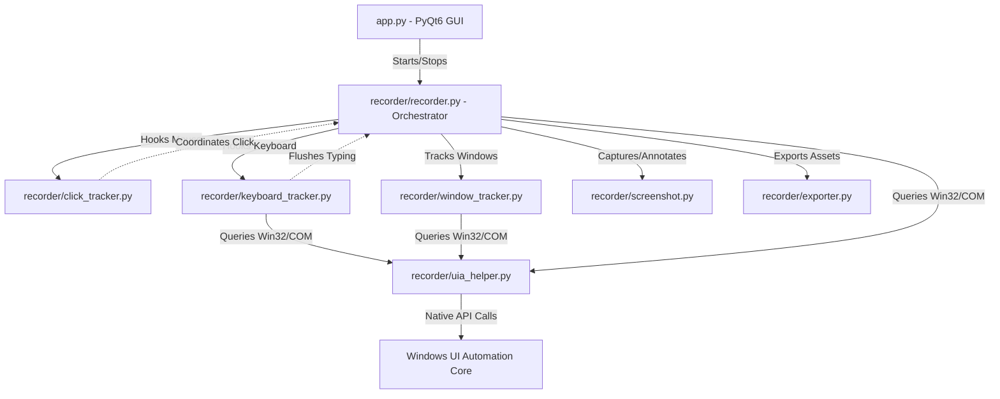

# Documentation Bot - Desktop Recorder Engine v1

This application is a high-fidelity, thread-safe desktop recorder for Windows. Its primary purpose is to capture user interactions (mouse clicks, keyboard typing, active window switches, and browser URLs) with annotated screenshots and serialize them into a structured JSON/ZIP package. This package is specifically formatted to be processed by LLMs (such as Claude) using technical documentation prompts to generate professional enterprise-grade user manuals.

---

## 1. High-Level Architecture

The application is structured as a modular desktop utility combining a Python/PyQt6 GUI frontend with native Windows OS event hooks and Accessibility API queries:



---

## 2. Technical Libraries Used

The engine leverages several powerful Python and Windows-specific libraries:

*   **`pywin32` (`win32gui`, `win32process`)**: Interfaces directly with the Windows API to detect active foreground windows (`GetForegroundWindow`), read window titles (`GetWindowText`), and query windows class names (`GetClassName`).
*   **`ctypes` (Python Standard Library)**: A foreign function library for Python. We use it to load and interact with native Windows DLLs (`ole32.dll` and `UIAutomationCore.dll`). It enables calling COM (Component Object Model) interface methods directly via virtual tables (vtable offsets) to query coordinate elements without heavy external dependencies.
*   **`pynput`**: Operates low-level global OS hooks to monitor mouse clicks (`pynput.mouse`) and keyboard strokes (`pynput.keyboard`) even when the recorder is running in the background.
*   **`pyautogui`**: Captures raw full-screen screenshots across multiple displays.
*   **`Pillow` (`PIL`)**: Processes images to draw visual indicators (bold red bounding boxes around target elements or cursor circle highlights) before saving.
*   **`PyQt6`**: Renders the desktop GUI using Qt widgets and enforces modern dark mode aesthetics.

---

## 3. Directory and File Breakdown

### Root Directory

#### [app.py](file:///c:/doc_automation/user_manual_bot%20using%20screen%20recoder/app.py)
*   **Purpose**: Renders the graphical user interface.
*   **Design**: Uses Qt Style Sheets (QSS) for modern dark mode aesthetics, featuring custom cards (`#statusCard`), active status colors (vibrant red dot when recording, gray when idle), and flat-designed buttons.
*   **Key Classes**:
    *   `MainWindow`: Configures the widgets, registers button click events, and manages the start/stop state.
    *   `RecorderBridge`: A thread-safe communication bridge. It inherits from `QObject` and defines a `pyqtSignal(int, str)`.
*   **Key Mechanisms**:
    *   *Thread Safety*: Because `pynput` listener hooks execute on separate background OS threads, directly modifying PyQt widgets from their callbacks would crash the app. The recorder emits the `step_logged` signal from the background threads, which PyQt safely marshals to `on_step_logged` on the main GUI thread.

#### [requirements.txt](file:///c:/doc_automation/user_manual_bot%20using%20screen%20recoder/requirements.txt)
*   **Purpose**: Lists python packages required by the application.

#### [verify_recorder.py](file:///c:/doc_automation/user_manual_bot%20using%20screen%20recoder/verify_recorder.py)
*   **Purpose**: Runs the recording backend programmatically in a CLI environment for 10 seconds. It intercepts click coordinates, validates the directory structures, extracts files from the generated `.zip`, and prints the logged JSON to verify the system end-to-end.

---

### Package: `recorder/`

#### [recorder/__init__.py](file:///c:/doc_automation/user_manual_bot%20using%20screen%20recoder/recorder/__init__.py)
*   **Purpose**: Initializes `recorder` as a Python package.

#### [recorder/recorder.py](file:///c:/doc_automation/user_manual_bot%20using%20screen%20recoder/recorder/recorder.py)
*   **Purpose**: Serves as the central controller/orchestrator of the engine.
*   **Key Classes**:
    *   `ActionStep`: A Python `dataclass` representing a recorded event, conforming to the schema:
        ```python
        @dataclass
        class ActionStep:
            step_no: int
            timestamp: str
            action_type: str  # "click" | "input" | "window_change"
            window_title: str
            screenshot: str
            metadata: dict
        ```
    *   `Recorder`: Starts and stops all listeners, manages step numbering, coordinates folder creation, and transforms OS events into `ActionStep` logs.
*   **Key Methods**:
    *   `start()`: Formulates a unique session ID (`recording_YYYYMMDD_HHMMSS`), instantiates folder structures, and starts mouse/keyboard listeners.
    *   `stop()`: Shuts down listeners, flushes pending typing buffers, calls the exporter to write JSON data, and packages files into a ZIP.
    *   `_on_click(x, y, button, pressed)`: Flushes typing, checks if the active window changed (logging a `window_change` step if so), queries the clicked UI element boundaries, takes a screenshot, and logs a `click` step.
    *   `_on_input(field_name, value, is_sensitive)`: Receives grouped keystrokes, takes a screenshot highlighting the input area, and logs an `input` step.
    *   `_check_window_change()`: Queries win32 window handles. If a window switch occurs, captures a screenshot of the new active window and records a `window_change` event.

#### [recorder/uia_helper.py](file:///c:/doc_automation/user_manual_bot%20using%20screen%20recoder/recorder/uia_helper.py)
*   **Purpose**: Communicates with the Windows UI Automation (UIA) COM framework using pure `ctypes`. It acts as the "eyes" of the recorder to inspect the structure of screens, text fields, and browser tabs.
*   **Key Concepts**:
    *   *Virtual Table Calling (`call_com`)*: C++ COM objects place function pointers in a virtual table (vtable). `call_com` dereferences the object pointer, offsets it to retrieve the method address (e.g., vtable offset 23 for `get_CurrentName`), casts it to a Python callback prototype (`WINFUNCTYPE`), and executes it.
    *   *COM Thread Apartments*: COM requires initialization on each thread that accesses it. This module invokes `CoInitialize(None)` at the beginning of each API call and `CoUninitialize()` in a `finally` block. It instantiates its own `CUIAutomation` object locally per call. This prevents cross-thread marshalling errors and access violations.
*   **Key Methods**:
    *   `get_element_at(x, y)`: Calls UIA `ElementFromPoint` to retrieve name, control type, class name, and bounding box coordinates (`RECT`) of the UI element under the mouse.
    *   `get_focused_element_info()`: Calls UIA `GetFocusedElement` to identify the text input field active when typing begins.
    *   `get_browser_url(hwnd)`: Performs a depth-first search (DFS) traversal down the UIA tree of browser windows (Chrome/Edge/Firefox). It identifies the address bar edit element (class `OmniboxViewViews` or name "Address and search bar") and extracts the active tab's URL.
    *   `is_sensitive_element(x, y)`: Inspects element properties to identify passwords, PINs, or credit card labels for redaction.

#### [recorder/click_tracker.py](file:///c:/doc_automation/user_manual_bot%20using%20screen%20recoder/recorder/click_tracker.py)
*   **Purpose**: Listens to global mouse click events.
*   **Key Methods**:
    *   `start()` / `stop()`: Spawns and stops `pynput.mouse.Listener`.
    *   `_on_click(x, y, button, pressed)`: Receives system click reports and forwards them to the recorder orchestrator.

#### [recorder/keyboard_tracker.py](file:///c:/doc_automation/user_manual_bot%20using%20screen%20recoder/recorder/keyboard_tracker.py)
*   **Purpose**: Groups global keystrokes into clean text blocks.
*   **Key Methods**:
    *   `_on_press(key)`: Appends keys to a buffer. Backspaces remove characters, and spaces are parsed. If the buffer transition from empty to populated occurs, it immediately calls UIA `get_focused_element_info()` to capture the active input field name (e.g. "Vendor Name") and check if it's sensitive.
    *   `flush()`: If the buffer holds characters, collapses them into a string. If the active element name or control properties indicate a password/sensitive input, it redacts the text value to `[REDACTED]`. It calls the `input_callback` to log the step and resets typing states.
    *   *Flushing Boundaries*: Flushing is triggered automatically when special keys are pressed (Enter, Tab, Escape) or when the mouse is clicked (meaning focus shifted to another control).

#### [recorder/screenshot.py](file:///c:/doc_automation/user_manual_bot%20using%20screen%20recoder/recorder/screenshot.py)
*   **Purpose**: Captures screen images and overlays highlights.
*   **Key Methods**:
    *   `capture_screenshot(filename, click_coords, highlight_rect)`: Captures the screen. If UIA returned a bounding rectangle (`highlight_rect`), it uses Pillow (`ImageDraw.rectangle`) to draw a red highlight outline around the element. If UIA could not resolve the element bounding box, it falls back to drawing a target circle (`ImageDraw.ellipse`) centered directly at the `click_coords`.

#### [recorder/window_tracker.py](file:///c:/doc_automation/user_manual_bot%20using%20screen%20recoder/recorder/window_tracker.py)
*   **Purpose**: Detects window properties and switches.
*   **Key Methods**:
    *   `get_active_window_info()`: Queries the active window handle using `win32gui.GetForegroundWindow`. If the window's OS class name corresponds to Chromium (`Chrome_WidgetWin_1`) or Firefox (`MozillaWindowClass`), it queries UIA to retrieve the browser's active tab URL.

#### [recorder/exporter.py](file:///c:/doc_automation/user_manual_bot%20using%20screen%20recoder/recorder/exporter.py)
*   **Purpose**: Manages file storage, JSON formatting, and ZIP compression.
*   **Key Methods**:
    *   `create_session_layout(session_id)`: Generates `sessions/session_id/screenshots/` layout.
    *   `save_session(...)`: Serializes step structures to `session.json` and session statistics to `metadata.json`.
    *   `export_zip(session_id)`: Packages the session directory into `output/session_id.zip`.

---

## 4. Operational Step-by-Step Flow

When recording, the application goes through the following sequence for each action:

```text
[User Clicks Mouse]
        │
        ├──> [Keyboard Tracker Flushes Buffer] ──> Log input step (with redact check) & Save Screenshot
        │
        ├──> [Window Tracker Checks Active HWND]
        │         │
        │         └──> (If Changed) ──> Log window_change step & Save Screenshot
        │
        ├──> [UI Automation Helper Queries Element] ──> Get bounding box, Name & Control Type
        │
        ├──> [Screenshot Captured & Annotated] ──> Draw Red Box (or click target circle fallback)
        │
        └──> [ActionStep Logged] ──> Add to step list in memory
```
