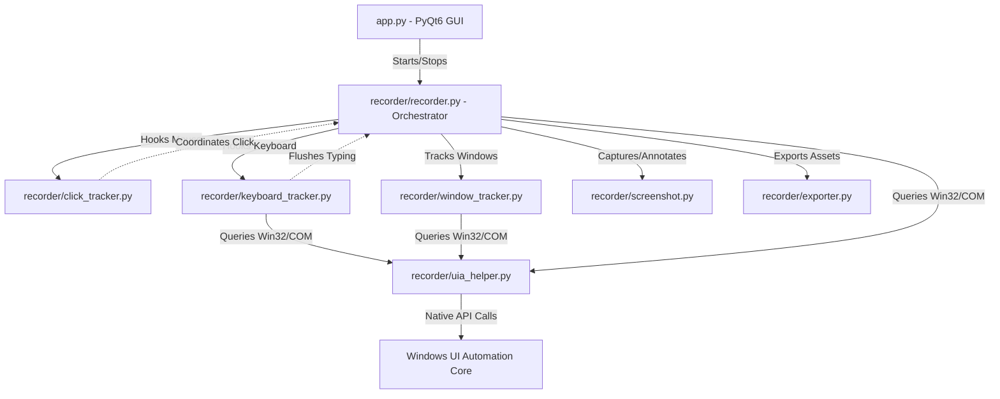

# 🎥 Desktop Recorder Engine — Documentation Bot v1

A high-fidelity, thread-safe desktop interaction recorder designed specifically for Windows. It captures user mouse clicks, keyboard inputs, active window switches, and browser URLs alongside annotated, cropped screenshots. The captured events are structured and packaged into a ZIP archive containing a clean JSON file, ready to be processed by LLMs (such as Gemini or Claude) using prompt-engineering to generate professional, enterprise-grade user manuals.

---

## ⚡ Quick Start: Clone & Configure

Follow these steps to pull, configure, and run the project locally on your machine.

### 1. Prerequisites
- **OS**: Windows 10 / 11 (Native Win32 APIs and COM are required)
- **Python**: Version 3.10 or higher
- **Permissions**: Administrator or user account with access to monitor UI events (mouse/keyboard hook permissions).

### 2. Setup Guide

```bash
# Clone the repository
git clone https://github.com/<your-username>/<your-repo-name>.git
cd "user_manual_bot using screen recoder"

# Create a virtual environment (recommended)
python -m venv venv

# Activate the virtual environment
# On Windows Command Prompt:
venv\Scripts\activate.bat
# On Windows PowerShell:
.\venv\Scripts\Activate.ps1

# Install dependencies
pip install -r requirements.txt
```

### 3. Running the App

To run the full **PyQt6 GUI application**:
```bash
python app.py
```

To run a **headless validation session** (runs a 10-second capture, validates files, and inspects output):
```bash
python verify_recorder.py
```

---

## 🛠️ Configuration & Settings

No manual configuration is required to get started. The application automatically handles:
- **Automatic Output Archiving**: Saved sessions are zipped and placed in the `/output` folder.
- **Local Sessions Store**: Raw frame data and logs are placed in the `/sessions` folder.
- **Sensitive Fields Redaction**: Automatically identifies inputs corresponding to password/PIN fields and redacts the typed text.

Both `/output` and `/sessions` directories are listed in `.gitignore` to prevent committing session captures to Git.

---

## 1. High-Level Architecture

The application is structured as a modular desktop utility combining a Python/PyQt6 GUI frontend with native Windows OS event hooks and Accessibility API queries:



---

## 2. Technical Libraries Used

The engine leverages several powerful Python and Windows-specific libraries:

*   **`pywin32` (`win32gui`, `win32process`, `win32api`)**: Interfaces directly with the Windows API to detect active foreground windows (`GetForegroundWindow`), read window titles (`GetWindowText`), and query windows class names (`GetClassName`).
*   **`uiautomation`**: A wrapper library for the Microsoft UI Automation API. It allows the recorder to inspect native UI element attributes (such as class names, coordinates, and passwords fields) and extract browser URLs from Chrome, Edge, and Firefox.
*   **`pynput`**: Operates low-level global OS hooks to monitor mouse clicks (`pynput.mouse`) and keyboard strokes (`pynput.keyboard`) even when the recorder is running in the background.
*   **`pyautogui`**: Captures raw full-screen screenshots across multiple displays.
*   **`mss`**: A fast, pure-python screen capture module used to capture specific window dimensions during multi-scroll captures.
*   **`opencv-python` (`cv2`) & `numpy`**: Performs image template matching and stitching for stitching scrolled page captures.
*   **`Pillow` (`PIL`)**: Processes images to draw visual indicators (bold red bounding boxes around target elements or cursor circle highlights) before saving.
*   **`PyQt6`**: Renders the desktop GUI using Qt widgets and enforces modern dark mode aesthetics.

---

## 3. Directory and File Breakdown

### Root Directory

#### [app.py](file:///c:/doc_automation/user_manual_bot%20using%20screen%20recoder/app.py)
*   **Purpose**: Renders the graphical user interface.
*   **Design**: Uses Qt Style Sheets (QSS) for modern dark mode aesthetics, featuring custom cards (`#statusCard`), active status colors (vibrant red dot when recording, gray when idle), and flat-designed buttons.
*   **Key Classes**:
    *   `MainWindow`: Configures the widgets, registers button click events, and manages the start/stop state.
    *   `RecorderBridge`: A thread-safe communication bridge. It inherits from `QObject` and defines a `pyqtSignal(int, str)`.
*   **Key Mechanisms**:
    *   *Thread Safety*: Because `pynput` listener hooks execute on separate background OS threads, directly modifying PyQt widgets from their callbacks would crash the app. The recorder emits the `step_logged` signal from the background threads, which PyQt safely marshals to `on_step_logged` on the main GUI thread.

#### [requirements.txt](file:///c:/doc_automation/user_manual_bot%20using%20screen%20recoder/requirements.txt)
*   **Purpose**: Lists Python packages required by the application.

#### [verify_recorder.py](file:///c:/doc_automation/user_manual_bot%20using%20screen%20recoder/verify_recorder.py)
*   **Purpose**: Runs the recording backend programmatically in a CLI environment for 10 seconds. It intercepts click coordinates, validates the directory structures, extracts files from the generated `.zip`, and prints the logged JSON to verify the system end-to-end.

---

### Package: `recorder/`

#### [recorder/__init__.py](file:///c:/doc_automation/user_manual_bot%20using%20screen%20recoder/recorder/__init__.py)
*   **Purpose**: Initializes `recorder` as a Python package.

#### [recorder/recorder.py](file:///c:/doc_automation/user_manual_bot%20using%20screen%20recoder/recorder/recorder.py)
*   **Purpose**: Serves as the central controller/orchestrator of the engine.
*   **Key Classes**:
    *   `ActionStep`: A Python `dataclass` representing a recorded event, conforming to the schema:
        ```python
        @dataclass
        class ActionStep:
            step_no: int
            timestamp: str
            action_type: str  # "click" | "input" | "window_change"
            window_title: str
            screenshot: str
            metadata: dict
        ```
    *   `Recorder`: Starts and stops all listeners, manages step numbering, coordinates folder creation, and transforms OS events into `ActionStep` logs.
*   **Key Methods**:
    *   `start()`: Formulates a unique session ID (`recording_YYYYMMDD_HHMMSS`), instantiates folder structures, and starts mouse/keyboard listeners.
    *   `stop()`: Shuts down listeners, flushes pending typing buffers, calls the exporter to write JSON data, and packages files into a ZIP.
    *   `_on_click(x, y, button, pressed)`: Flushes typing, checks if the active window changed, queries the clicked UI element boundaries, takes a screenshot, and logs a `click` step.
    *   `_on_input(field_name, value, is_sensitive)`: Receives grouped keystrokes, takes a screenshot highlighting the input area, and logs an `input` step.
    *   `_check_window_change()`: Queries win32 window handles. If a window switch occurs, captures a screenshot of the new active window and records a `window_change` event.

#### [recorder/uia_helper.py](file:///c:/doc_automation/user_manual_bot%20using%20screen%20recoder/recorder/uia_helper.py)
*   **Purpose**: Communicates with the Windows UI Automation (UIA) COM framework. It acts as the "eyes" of the recorder to inspect the structure of screens, text fields, and browser tabs.
*   **Key Concepts**:
    *   *UIA API Integration*: Queries native Windows UI Automation components in a thread-safe manner by managing initialization (`CoInitialize`) and release sequences locally.
*   **Key Methods**:
    *   `get_element_at(x, y)`: Retrieves name, control type, class name, and bounding box coordinates (`RECT`) of the UI element under the mouse.
    *   `get_focused_element_info()`: Identifies the text input field active when typing begins.
    *   `get_browser_url(hwnd)`: Performs tree traversal down the UIA tree of browser windows to locate browser address bars and extract the active tab's URL.
    *   `is_sensitive_element(x, y)`: Inspects element properties to identify passwords, PINs, or credit card labels for redaction.

#### [recorder/click_tracker.py](file:///c:/doc_automation/user_manual_bot%20using%20screen%20recoder/recorder/click_tracker.py)
*   **Purpose**: Listens to global mouse click events.
*   **Key Methods**:
    *   `start()` / `stop()`: Spawns and stops `pynput.mouse.Listener`.
    *   `_on_click(x, y, button, pressed)`: Receives system click reports and forwards them to the recorder orchestrator.

#### [recorder/keyboard_tracker.py](file:///c:/doc_automation/user_manual_bot%20using%20screen%20recoder/recorder/keyboard_tracker.py)
*   **Purpose**: Groups global keystrokes into clean text blocks.
*   **Key Methods**:
    *   `_on_press(key)`: Appends keys to a buffer. Backspaces remove characters, and spaces are parsed.
    *   `flush()`: Collapses buffer characters into a string. Redacts passwords or sensitive input fields to `[REDACTED]`. Calls the `input_callback` to log the step.

#### [recorder/screenshot.py](file:///c:/doc_automation/user_manual_bot%20using%20screen%20recoder/recorder/screenshot.py)
*   **Purpose**: Captures screen images and overlays highlights.
*   **Key Methods**:
    *   `capture_screenshot(filename, click_coords, highlight_rect)`: Captures the screen. Draws a red highlight outline around the element if UIA bounding box is available, otherwise draws a fallback circle around coordinates.

#### [recorder/window_tracker.py](file:///c:/doc_automation/user_manual_bot%20using%20screen%20recoder/recorder/window_tracker.py)
*   **Purpose**: Detects window properties and switches.
*   **Key Methods**:
    *   `get_active_window_info()`: Queries the active window handle using `win32gui.GetForegroundWindow`. Classifies process names (e.g. browser, terminal, office app) and grabs browser URLs.

#### [recorder/exporter.py](file:///c:/doc_automation/user_manual_bot%20using%20screen%20recoder/recorder/exporter.py)
*   **Purpose**: Manages file storage, JSON formatting, and ZIP compression.
*   **Key Methods**:
    *   `create_session_layout(session_id)`: Generates `sessions/session_id/screenshots/` layout.
    *   `save_session(...)`: Serializes raw steps to `session.json` and session statistics to `metadata.json`. Runs `WorkflowCleaner` to export simplified steps.
    *   `export_zip(session_id)`: Packages the session directory into `output/session_id.zip`.

#### [recorder/workflow_cleaner.py](file:///c:/doc_automation/user_manual_bot%20using%20screen%20recoder/recorder/workflow_cleaner.py)
*   **Purpose**: A post-processing module that groups raw steps (e.g. typing details and click events) into logical, human-readable workflow steps.
*   **Key Methods**:
    *   `clean()`: Analyzes and groups steps into logical sequences (e.g., combining input events and confirm buttons) to optimize JSON output for LLM consumption.

---

## 4. Operational Step-by-Step Flow

When recording, the application goes through the following sequence for each action:

```text
[User Clicks Mouse]
        │
        ├──> [Keyboard Tracker Flushes Buffer] ──> Log input step (with redact check) & Save Screenshot
        │
        ├──> [Window Tracker Checks Active HWND]
        │         │
        │         └──> (If Changed) ──> Internal update of window references (doesn't spam steps)
        │
        ├──> [UI Automation Helper Queries Element] ──> Get bounding box, Name & Control Type
        │
        ├──> [Screenshot Captured & Annotated] ──> Draw Red Box (or click target circle fallback)
        │
        └──> [ActionStep Logged] ──> Add to step list in memory & export to session.json
```
